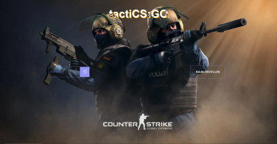
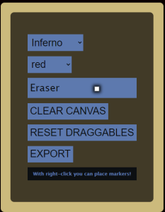
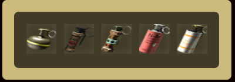
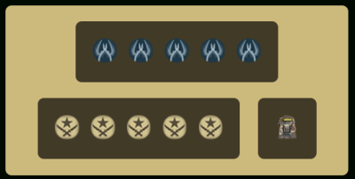
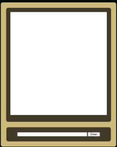

# App

## Landing Page

Wenn ein Benutzer über Google (o.Ä.) auf unsere Seite kommt, landet er hier.
Hier kann er entweder einen neuen Raum erstellen (Wobei der Code für den Raum zufällig generiert wird), oder er kann einem schon vorhandenen Raum beitreten, indem er den 5-stelligen Code des Raumes in ein Feld eingibt.

## Taktikraum

Der Taktikraum besteht aus dem linken, mittleren und rechten Abschnitt. Im linken Abschnitt findet der Benutzer das Menü und die Utilities. Im mittleren Abschnitt befindet sich die bemalbare Karte. Im rechten Abschnit befinden sich die Dragobjekte und der Chat.

### Karte/Canvas (mitte)

In der Mitte des Screens ist die Karte zu sehen, über dieser eine Canvas liegt, auf der der Benutzer per Linksklick malen, radieren und Utilities draufstempeln kann. Zudem kann der Benutzer per Rechtsklick einen Marker erstellen, welcher auf das Canvas gemalt wird. Die Canvas wird nach jeder Aktion mit den anderen Nutzern synchronisiert.

### Tools (oben links)

Der Nutzer hat hier die Möglichkeit per Drop-down-menü die Map und seine Farbe zu ändern. Zudem kann man mithilfe einer Checkbox zwischen dem Radiergummi und dem Stift wechseln.
Der clear-Canvas-Button setzt die Map auf den Anfangszustand zurück. Mithilfe des reset-draggables-button werden alle Draggable Elemente zurückgesetzt. Zusätzlich kann der Nutzer sich mit dem Export-Button die aktuelle Canvas als PNG herunterladen. Dabei werden jedoch nicht die Dragobjekte exportiert. Zuletzt wird mit einer Anmerkung auf die Möglichkeit, Marker mit rechtsklick zu setzen, hingewiesen.

### Utilities (mitte links)

Hier kann der Benutzer alle fünf verschiedenen Granaten auswählen, und mit einem Linksklick auf der Karte platzieren, sodass sie für alle sichtbar werden.

### Spieler/Bombe-Marker (oben rechts)

Per Drag & Drop kann der Benutzer folgende Marker platzieren:
- 5 x Counter-Terrorist
- 5 x Terrorist
- 1 x Bombe

Sobald der Benutzer den Marker auf der Map loslässt, wird er an dieser Position für alle Benutzer angezeigt.

### Chat (mitte rechts)

Im Chat können die Benutzer eines Raumes miteinander chatten. Dabei ist der angezeigte Nutzername die Session-ID des jeweiligen Nutzers. Der Chat ist nicht persistent.