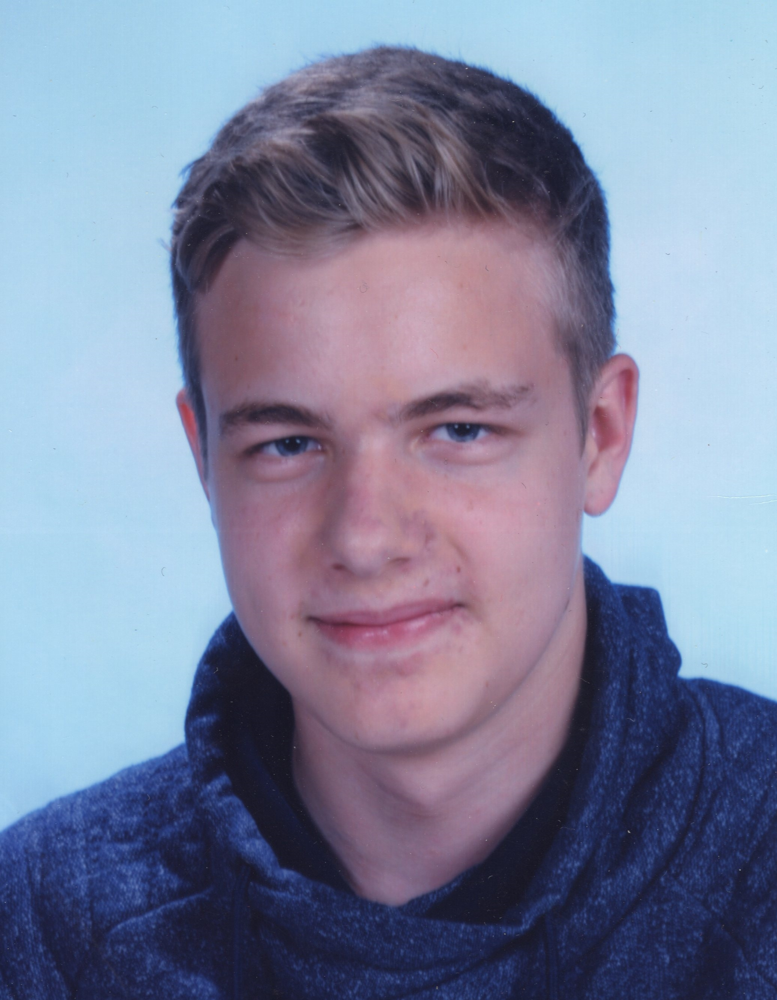

# Team

## Jonathan Sören Schmid

- E-Mail: jonathan-soeren.schmid@stud.uni-regensburg.de
- Github: jonyschmid
- Entwickelte Komponenten: Exportfunktion, Canvas, Aufbau und CSS von index, Radiergummi und Clearbutton

## Christian Anh Duy Nguyen Duc

- E-Mail Christian-Anh-Duy.Nguyen-Duc@stud.uni-regensburg.de
- Github: chris78cn
- Entwickelte Komponenten: Marker, Zeichenfarbe ändern

## Johannes Hoffmann

- Email: johannes-maximilian.hoffmann@stud-uni-regensburg.de
- Github: Velnar
- Entwickelte Komponenten: Server-Client-Sync, Karten-Auswahl

## Tobias Lanzl

- E-Mail: tobias.lanzl@stud.uni-regensburg.de
- Github: lat26358
- Entwickelte Komponenten: Draggables, Granaten, Landing-Page